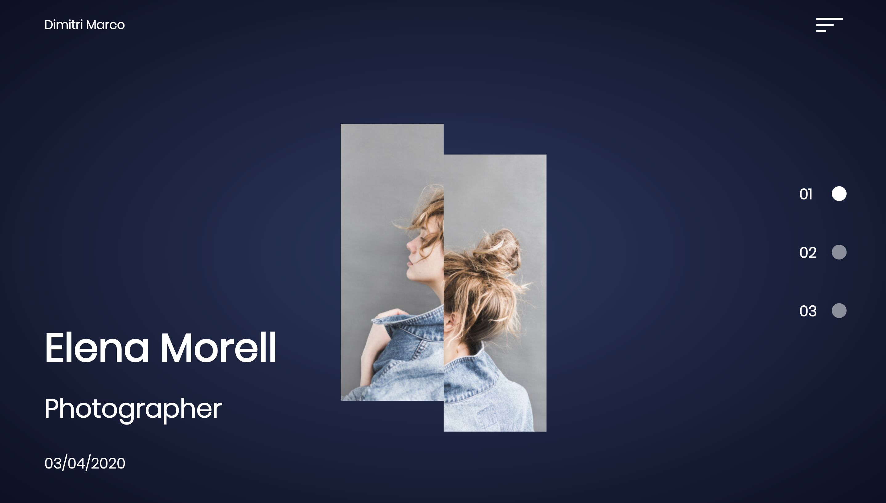
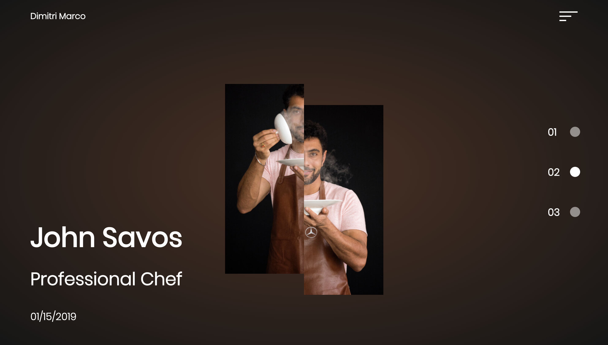
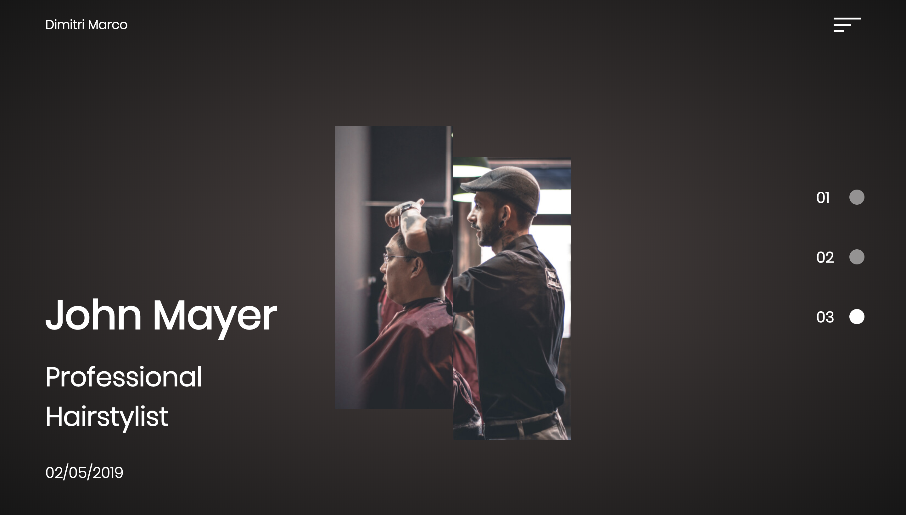
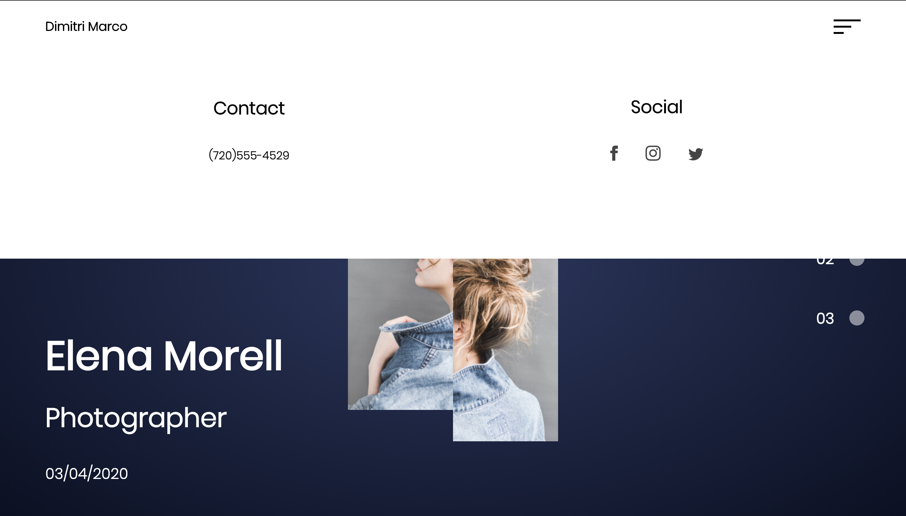
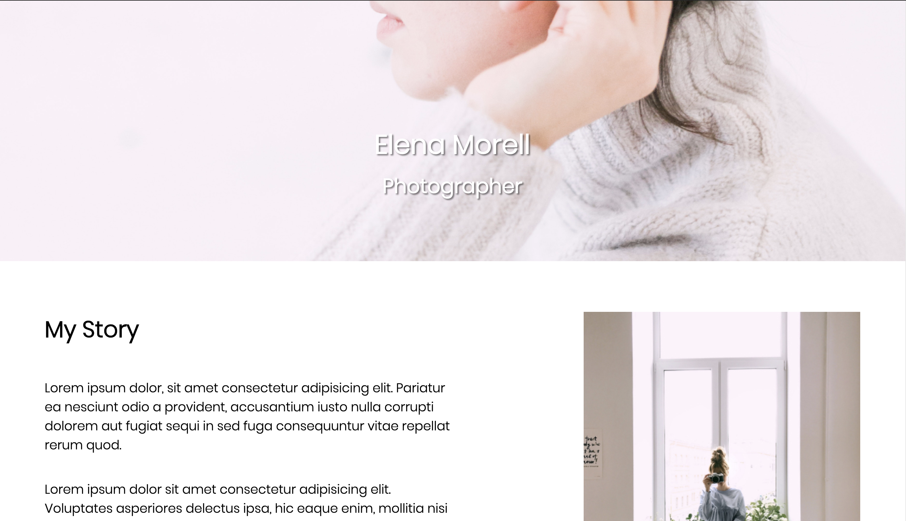
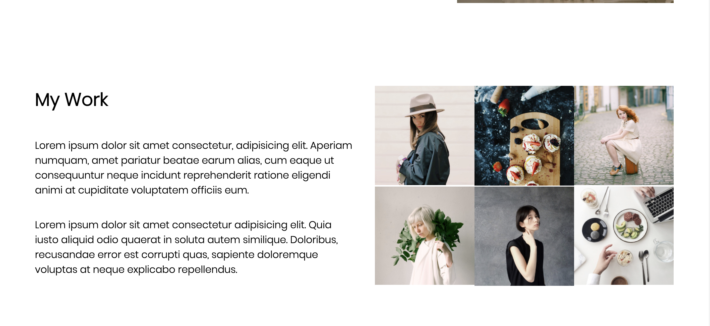
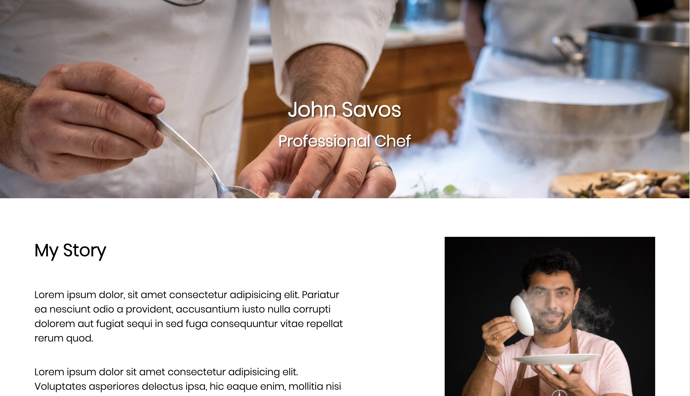
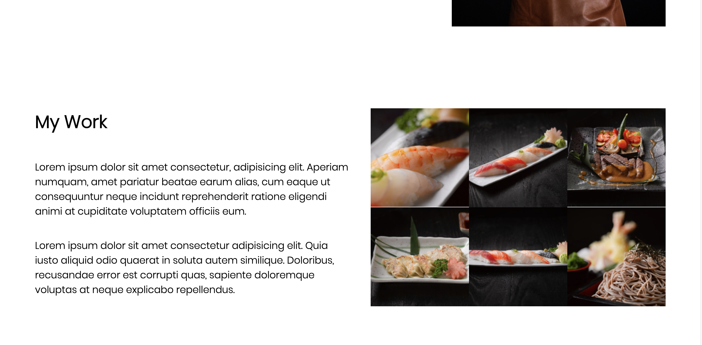
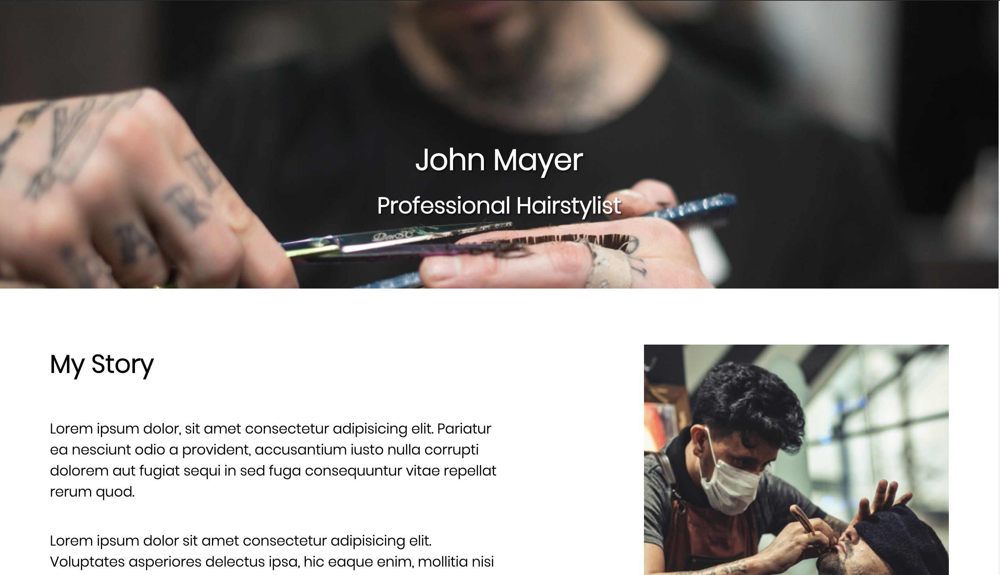
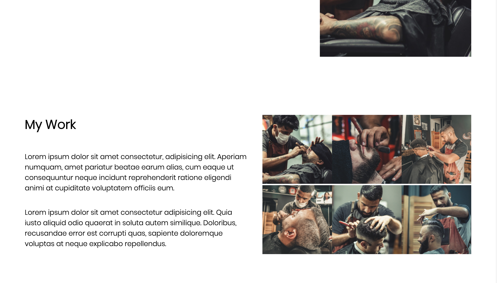

# Mock-Professional-Website
https://bbrier14.github.io/Mock-Professional-Website/
## Overview
This project is vanilla Javascript-based website. It is a mock-website for professionals to share their story and profession with the user. This project is meant to showcase various animations and styling.
## How it Works
The user can scroll or press one of three buttons to look at one of the three different professionals on the site. In order to read more about the specific professional, the user simply clicks on their image and are taken to the professionals personal page. 
## Technologies Used
HTML5, CSS3, Javascript, & GSAP
## Role
This is a solo project
## Screenshots

